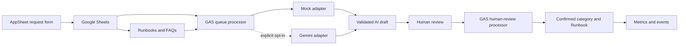

# OpsFlow Runbook Hub

Synthetic IT operations request and runbook hub built as a portfolio MVP.

日本語表示名: `IT運用依頼・手順書ハブ`

## Current Status

status:: owner-only-three-decision-review-applied-and-verified
version:: 0.1.0
data_scope:: synthetic-only
google_assets:: private-sheet-and-bound-apps-script-created
apps_script_scope:: current-spreadsheet-only
mock_queue_e2e:: sheet-and-appsheet-action-verified-2026-08-18
appsheet_review_e2e:: accepted-edited-rejected-applied-2026-08-18
appsheet_app:: owner-only-prototype-applied-and-verified
appsheet_deployment:: not-deployed
gemini_connection:: disabled-and-not-deployed-remotely
public_release:: standalone-candidate-prepared-2026-08-18

The local scaffold and a private Google-side mock prototype are implemented.
Local validation still runs without npm dependencies or external network
access. The live Google prototype contains synthetic data only.

Implemented:

- Request, Runbook, FAQ, AI draft, review and event schemas
- 20 synthetic requests, 4 synthetic Runbooks and 8 FAQs
- Deterministic mock AI adapter
- Optional Gemini adapter with an explicit enable gate
- AI output validation and prohibited-action checks
- Queue orchestration with one bounded retry
- Human accept, edit and reject decision logic
- Google Sheets repository and explicit setup/seed functions
- Private native Google Sheet with six configured tables
- Container-bound Apps Script project with current-document-only access
- Live mock queue E2E from `REQ-0001` to a reviewable AI draft and audit event
- Owner-only AppSheet prototype with six tables, eight slices and configured
  views, validation and table permissions
- AppSheet mock queue action verified with `REQ-0002` through `queued`, GAS
  processing, `ready` and a matching audit event
- Three AppSheet review actions with a ref-only Review Form and Form Saved
  orchestration, verified for accepted, edited and rejected decisions
- GAS human-review processor with Sheet-menu execution, checklist-array safety
  validation, Request field application and idempotent review events
- Three synthetic review decisions applied: accepted retained the suggested
  values, edited changed category and Runbook, and rejected left its Request
  unchanged
- AppSheet configuration and view specifications
- Local automated tests and sample-data validation

Not implemented, activated or deployed:

- Automatic AppSheet-to-GAS review application through a Bot or trigger; the
  verified prototype uses the explicit Sheet menu
- AppSheet deployment, sharing, Bots or automation
- AppSheet billing plan or contract
- Gemini API calls or billing
- Real user, employer, client or production data
- Automated account, permission, credential or production actions
- Public GitHub repository or marketplace publication

## What This Demonstrates

This project is intended to show more than AI-assisted coding:

- business workflow and state design;
- small internal-tool data modeling;
- IT operations documentation and Runbook structure;
- human-in-the-loop AI review;
- failure handling and audit evidence;
- synthetic-data and secret-handling boundaries;
- operational documentation for handoff.

It must be described as a self-initiated synthetic project, not paid work or a
client deployment.

## Architecture



The local repository contains the GAS-compatible logic and synthetic data. The
private Google Sheet and bound Apps Script project have been validated in mock
mode. The private Owner-only AppSheet prototype is configured and its mock
queue action, three review decisions and explicit GAS review application are
verified, but it remains `Not Deployed`. Gemini remains behind a separate
approval gate.

## Local Validation

Requirements:

- Node.js 24 or later
- No `npm install` required

Run all tests:

```powershell
cd .\it-ops-runbook-hub
npm test
```

Validate schemas, references, mock results and sensitive-pattern checks:

```powershell
npm run validate:samples
npm run scan:release
```

Expected result for version 0.1.0:

- 30 automated tests pass
- 20/20 synthetic requests match the expected mock category and Runbook
- 0 sensitive-pattern findings in sample content
- 0 private-asset, identity or credential findings in public text files

## Project Layout

```text
it-ops-runbook-hub/
  README.md
  LICENSE
  package.json
  portfolio/
    index.html
    assets/                  # cropped synthetic-only screenshots
  docs/
    requirements.md
    architecture.md
    data-model.md
    operation-guide.md
    test-report.md
    live-google-validation-2026-08-18.md
    portfolio-case-study.md
  gas/
    appsscript.example.json
    src/
      00_Config.gs
      10_Core.gs
      20_MockAiAdapter.gs
      30_GeminiAiAdapter.gs
      40_SheetRepository.gs
      50_QueueProcessor.gs
      55_ReviewProcessor.gs
      60_Setup.gs
      70_Menu.gs
      80_SeedData.gs
  sample-data/
    requests.csv
    runbooks.csv
    faqs.csv
    expected-results.csv
    mock-ai-fixtures.json
  scripts/
    scan-public-release.js
    validate-samples.js
  tests/
```

## Safety Model

1. All sample records must have `is_synthetic=true`.
2. AI output is stored as a draft and never becomes a confirmed request value
   without an explicit human accept or edit decision.
3. AI output is rejected if it proposes password, permission, account, command
   or production actions.
4. An unknown category or Runbook ID is rejected.
5. API failure never blocks the underlying request workflow.
6. Gemini processing requires `OPSFLOW_GEMINI_ENABLED=true` plus separately
   stored Script Properties.
7. API keys must not be stored in Sheets, source files, screenshots or Git.
8. Public portfolio export must be separated from the private Vault and pass a
   fresh secret and personal-information review.

## Documents

- [Requirements](docs/requirements.md)
- [Architecture](docs/architecture.md)
- [Data model](docs/data-model.md)
- [Operation guide](docs/operation-guide.md)
- [Test report](docs/test-report.md)
- [Live Google validation](docs/live-google-validation-2026-08-18.md)
- [Portfolio case study](docs/portfolio-case-study.md)
- [Local portfolio demo](portfolio/index.html)
- [AppSheet configuration](app-sheet/configuration-guide.md)
- [AppSheet views](app-sheet/views.md)

## Known Limitations

- The live verification covers three deterministic mock jobs and one accepted,
  one edited and one rejected review. It does not cover concurrent or
  time-driven production operation.
- Review application is an explicit Sheet-menu operation. Automatic review
  processing, role/security filters, deployment, sharing, licensing and
  automation behavior remain unverified or inactive.
- Only the human-confirmed category and Runbook are applied to Requests. Final
  review summaries and checklist JSON remain in AI_Reviews as review evidence.
- The Gemini adapter is intentionally inactive and its current official model,
  endpoint, pricing and data terms must be rechecked before first use.
- The mock classifier is deterministic keyword/rule logic, not a quality claim
  about production AI.
- Synthetic testing is not equivalent to paid implementation experience.
- Source code and documentation in the future standalone public package use the
  MIT License. This does not change the private Google assets or grant access to
  the private AppSheet prototype.
