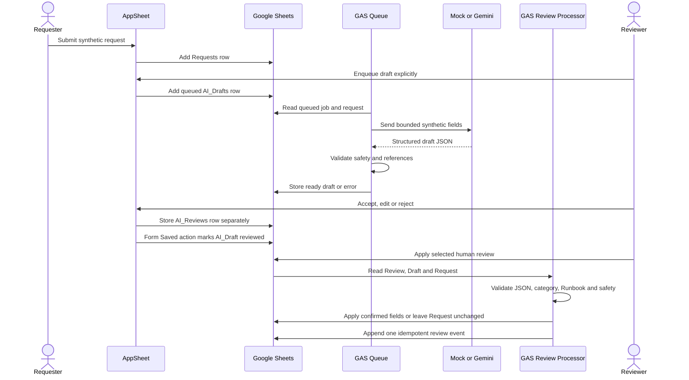

# Architecture

## Design Principles

1. The workflow works without AI.
2. AI output is always a separate draft.
3. External calls are opt-in and synthetic-only.
4. Errors are visible and recoverable.
5. Data and behavior can be explained in a portfolio review.

## Components

| Component | Responsibility | External state |
|---|---|---|
| AppSheet | Form, list, detail, review and metrics UI | Queue and all three review decisions tested; Not Deployed |
| Google Sheets | Six logical tables | Private synthetic prototype created |
| GAS Core | Validation, state and review rules | Implemented locally and bound remotely for mock mode |
| GAS Repository | Header-safe Sheet reads/writes | Bound and executed remotely |
| Queue Processor | Bounded batch, lock, retry and event handling | Sheet-menu and AppSheet-action mock E2E verified |
| Review Processor | Validate and apply selected human review idempotently | All three decisions executed remotely |
| Mock Adapter | Deterministic offline draft | Local and two live mock paths tested |
| Gemini Adapter | Optional external structured draft | Implemented locally; disabled and omitted remotely |
| Validator | Schema, reference, expected-result and secret checks | Implemented and tested |

## Runtime Flow



The live verification covers one accepted, one edited and one rejected
AppSheet review. Each form stored a separate AI_Reviews row and the chained
Form Saved action marked its draft `reviewed`. The operator then selected each
review row in Sheets and ran `Apply selected human review`.

The Review Processor calls `opsflowResolveReview`, rejects checklist JSON that
is not an array, and validates category, Runbook, safety rules and synthetic
scope. Accepted and edited decisions apply the confirmed category and Runbook
to Requests; rejected leaves its Request unchanged. Final summaries and
checklists remain in AI_Reviews. The review ID determines the event ID, so a
second execution returns without another Request_Events row.

The repository supports this path with `getDraft`, `getReview`, `getEvent` and
`updateRequestReviewFields`; it updates only the bounded Request review fields.

AI Review Form is a `ref` view, not a menu view. It is entered only through the
prominent `AIレビューを開始` `LINKTOFORM` action for an eligible `ready` draft.

## Queue Behavior

- Maximum batch: 10
- Maximum retry: 1
- Script lock prevents overlapping processors.
- `mock` and `gemini` jobs can be selected separately.
- Mock processing never falls through to Gemini.
- Errors are reduced to bounded error codes; raw exception or secret text is
  not written to the event note.
- A failed job becomes `error`; the Request remains usable.

## AI Boundary

Allowed input:

- Request ID
- Title and description
- Request type, impact and urgency
- Active Runbook ID, title, category and keywords

Required output:

- Summary draft
- Category suggestion
- Up to eight verification items
- Missing-information list
- Existing Runbook ID or `null`
- `needs_human_review=true`

Disallowed:

- Password or account changes
- Permission operations
- Command execution
- Production changes or restarts
- Invented facts
- Automatic confirmation or notification

## Failure Modes

| Failure | Behavior |
|---|---|
| Queue lock unavailable | Return `locked`; process nothing |
| Request missing | Mark AI draft `REQUEST_NOT_FOUND` |
| Request not synthetic | Mark `REQUEST_INVALID` |
| JSON invalid | Retry once, then error |
| Review checklist JSON is not an array | Reject the review application |
| Unknown category or Runbook | Retry once, then validation error |
| Unsafe execution action | Retry once, then validation error |
| Gemini HTTP/configuration failure | Record bounded error; do not alter Request |
| Sheet header mismatch | Refuse silent schema rewrite |
| Review event already exists | Return `already_processed`; make no new write |

## Trust Boundaries

```text
Private Vault
  |-- local source and synthetic data
  |-- no secrets
  v
Google prototype
  |-- private synthetic Sheet and bound Apps Script
  |-- current-document-only OAuth scope
  |-- private Owner-only AppSheet prototype; Not Deployed
  |-- no AppSheet sharing, Bot, trigger, billing plan or contract
  |-- no Gemini Script Properties configured
  v
Gemini API (future separate enablement)
  |-- bounded synthetic fields only
  v
Human review
  |-- only confirmed values may update workflow state
```

The future public repository must be exported from the self-contained project
folder, not by publishing or cloning the entire private Vault.
