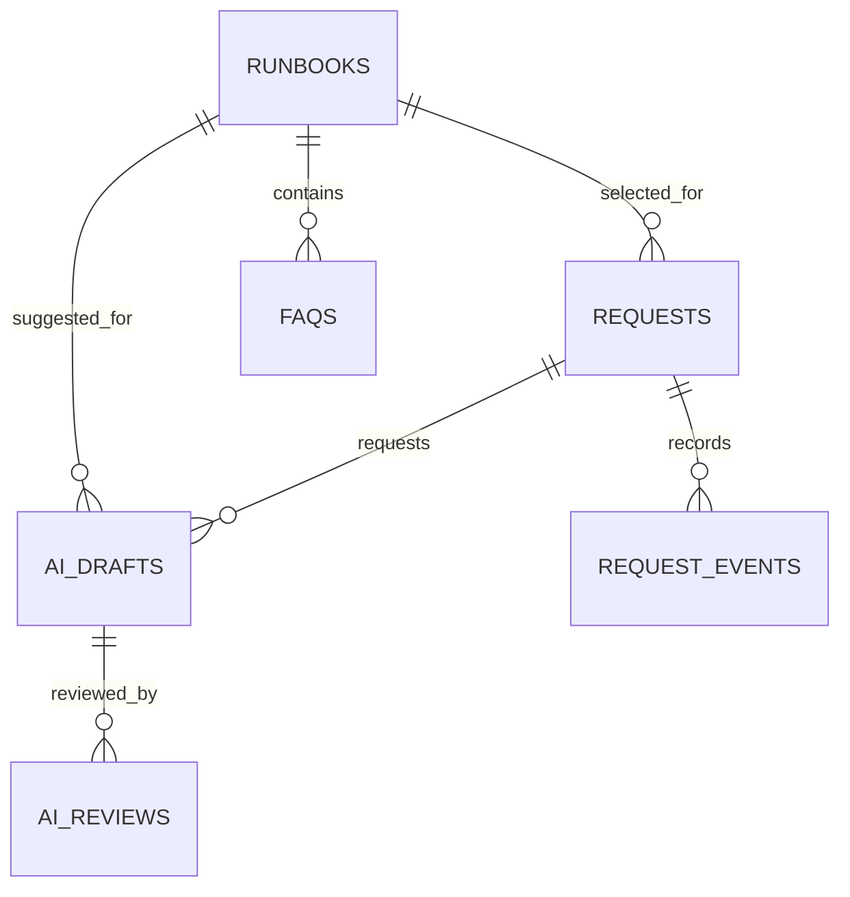

# Data Model

## Relationships



The canonical column order is defined in `gas/src/00_Config.gs` and checked
against the CSV files by `scripts/validate-samples.js`.

## Keys

| Table | Key | Example |
|---|---|---|
| Requests | `request_id` | `REQ-0001` |
| AI_Drafts | `ai_draft_id` | `AID-12AB34CD` |
| AI_Reviews | `review_id` | `REV-12AB34CD` |
| Runbooks | `runbook_id` | `RB-001` |
| FAQs | `faq_id` | `FAQ-001` |
| Request_Events | `event_id` | `EVT-AID-12AB34CD` |

## Request Status

```text
New -> Triaged -> In Progress -> Resolved -> Closed
                    |              ^
                    v              |
                 Waiting ----------+

New / Triaged / In Progress / Waiting -> Cancelled
Resolved -> In Progress
```

- `Resolved` requires `resolution`.
- `Closed` requires review confirmation at the UI/workflow layer.
- `Cancelled` requires `cancellation_reason`.
- AI status does not control Request status.

## AI Draft Status

```text
queued -> processing -> ready -> reviewed
                  |
                  +-> error
```

An error is terminal in version 0.1.0. A new explicit enqueue creates a new
draft row rather than erasing the failed evidence.

## Storage Rules

- `description` keeps the original synthetic request text.
- AI arrays are stored as JSON strings in Sheet cells.
- `raw_output` is for synthetic debugging only and should be omitted from a
  public screenshot.
- `confirmed_category` and `runbook_id` are human-confirmed fields.
- `AI_Reviews` preserves the final human decision separately.
- `Request_Events` stores only selected before/after fields, not full records.
- No Sheet cell stores an API key, OAuth value or real identity.

## Schema Change Rule

The setup helper creates missing sheets but refuses to overwrite a header row
that does not exactly match the expected schema. A schema migration must be a
reviewed change, not a silent side effect of opening or running the app.
